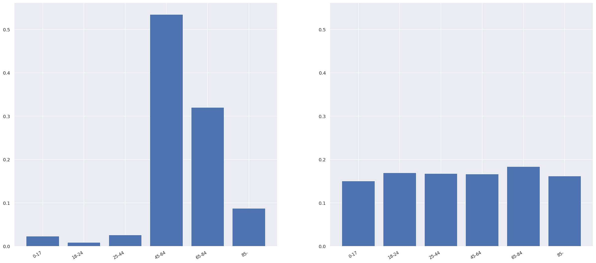
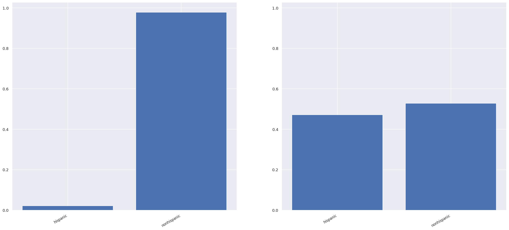
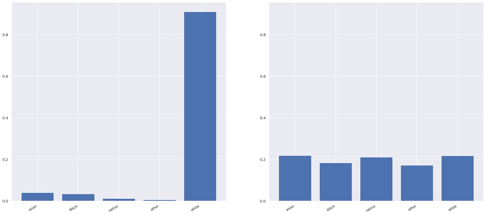
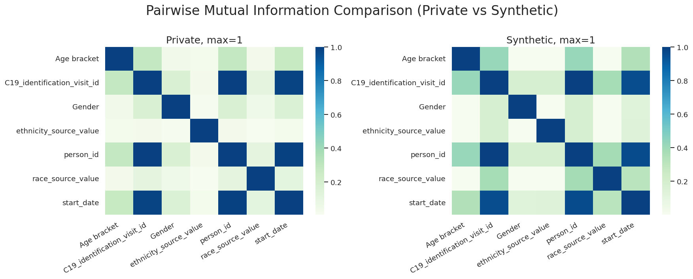
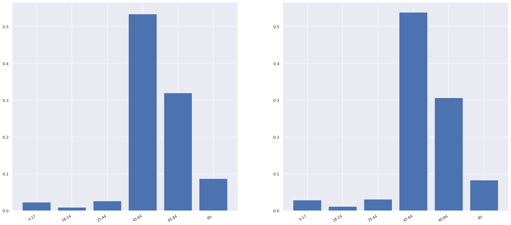
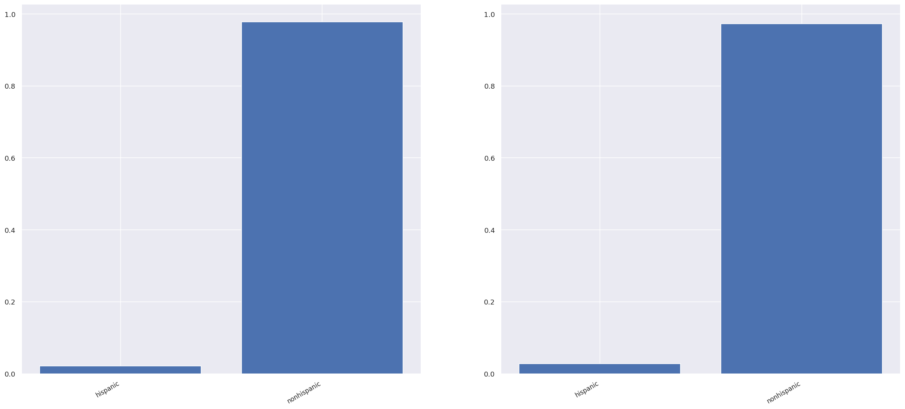
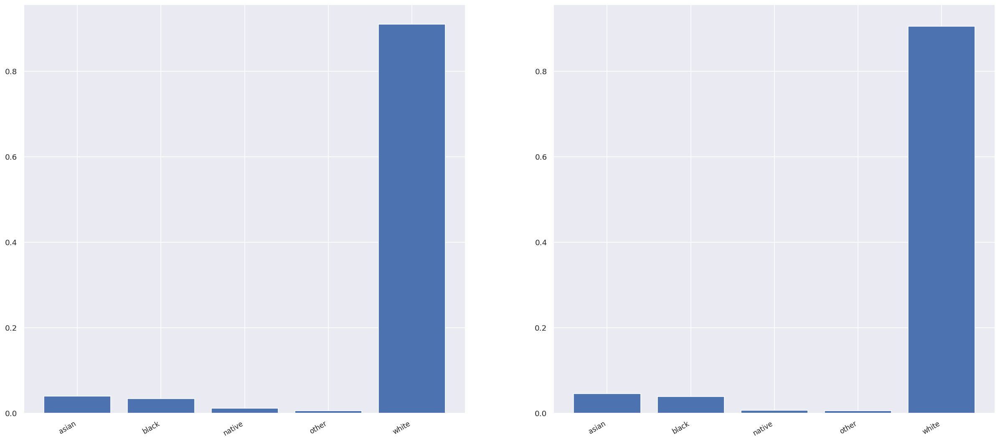
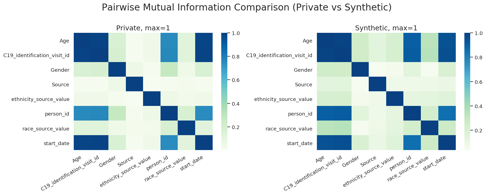

#  Synthetic-Data-Replica-for-Healthcare

## Description
 
**What is this?**

A tailored hands-on tutorial showing how to use Python to create synthetic data replica from healthcare datasets, in this case we are using a data schema called OMOP.

**What is a synthetic data replica?**

It's data that is created by an automated process which is intended to have the same statistical patterns as the original dataset but any individual field is generated by an algorithm with no reference to the existing dataset after training. It can be used in healthcare as a way to release data that has no personal information in it. This means you are agressively protecting patient privacy and exceeding HIPAA compliance by taking it outside a HIPAA environment.

**Who is this tutorial for?**

For any person who wants to be able to generate synthetic replica data from OMOP.

**Who are you?**

Jeremy Harper Biomedical Informatician Extraordinaire. Experienced executive, data scientist and available for consulting hit me up via linkedin. 

**Why did you make this?**

I thought A TUTORIAL was in order because this is a tranformational technology that has seen low adoption rates in healthcare and healthcare research. I adapted all of this so its building on the shoulders of others.

**How can I adopt this technology at my research organization?**

Step 1. Go to your IRB and have them determine that a synthetic data replica is non-human subjects. Have them identify/bless an honest data broker while you are there. As this protects patient privacy and when used properly can expidite useful research and help elimate paths that might have seen 6 months investment before being able to have data in hand to analyze its typically an easy sell after educating the IRB office. 

Step 2. Create reports out of a production healthcare instance as the honest broker.

Step 3. Use these modules and make the data available with synthetic data. 

Step 4. I love the idea of helping bring it to healthcare facilities and seeing them training to run this locally. Shoot me a note to tell me you've done it so I can grin. 

## Overview

In this tutorial you are taking a fake generated version of OMOP and generating synthetic data from it. Its not going to look real, that's unfortunate but its a limitation you're not going to bypass in a github released dataset. 

Just to be clear, we're not using actual patient data but are leveraging a synthea OMOP port and generating synthetic data from that.

The practical steps involve:

1. Create a flat file to synthesize: Provided at: ./data/COVID19Patients.csv
2. Run anonymization and generate the file: Provided at: /data/COVID19Patients_deidentify.csv
3. Generate synthetic dataset 
(Option A) is a dataset with strong coorelation between all the data to allow for unpredicted statistical analysis on realistic replica data: ./data/COVID19Patients_data_synthetic_correlated.csv
(Option B) is a dataset with no relation to the real data called random showing examples of all the data that might be in the dataset. Good for software development): ./data/COVID19Patients_data_random.csv 
(Option C) is a dataset with some relation to the real data called Independent each individual column would be representative of the statistics found for that column but will not represent any relationships to other data. My personal opinion is you are unlikely to find this valuable in healthcare targets: ./data/COVID19Patients_data_random.csv 
4. Analyse the synthetic datasets to see how similar they are to the original data found in plots folder.

You may be wondering, why can't we just do the synthetic data step and consider that as anonymization? If it's synthetic surely it won't contain any personal information?

*WARNING* Patterns picked up in the original data can be transferred to the synthetic data. This is especially true for outliers. For instance if there is only one person from an certain area over 85 and this shows up in the synthetic data, we might be able to re-identify them, you need to scrub small cell counts or expand your data apropriately to mask.


## Setup

Python3 must be installed you can check in terminal with 

```bash
python --version
```

Install required dependent libraries in a virtual environment. You can do that, for example, with venv in ubuntu https://realpython.com/python-virtual-environments-a-primer/

Commands need to be run from a terminal 

Create the virtual environment. python3 -m venv /path/
Activate the new environment you created. source venv/bin/activate
 (If you are running an M1 Mac you may need to run the following for matlab "brew install pkg-config" and "brew install freetype")

```bash
cd /path/to/repo/synthetic_data_tutorial/
python3 -m venv ./omop_venv
source ./omop_venv/bin/activate
pip3 install -r requirements_freeze.txt
pip3 install -r requirements.txt
sudo apt-get install python3-tk
```

## Generate mock OMOP dataset

We're going to leverage the work of Michael Shamberger who created a downloadable OMOP from synthea. https://forums.ohdsi.org/t/synthetic-data-with-simulated-covid-outbreak/10256 
The raw data already exists in folder `data` so feel free to browse that and load the data into mysql. (https://medium.com/macoclock/mysql-on-mac-getting-started-cecb65b78e) But you should be aware we need a flat file aggregate of any database file. A report in most peoples parlance. Generate your own fresh flat file with a sql statement of your choice after that you will load the data into a database engine. I've dropped some example SQL statements in the SQL folder. I'm only premaking the output for the tutorial file as I imagine most people will use this with real data.

Using the ./SQL/Example_Cohort_SQL_Statement.txt file I created the following file you can find in the database.

Creating file: COVID19Patients.csv
Columns:
person_id = The identity key
start_date = The Start date of COVID 19
C19_identification_visit_id = The visit ID where COVID was identified
Source = is the plain text from measurement
Gender = Male/Female/Unknown
Age = The age
Race_source_value = The race 
Ethnicity_source_value = The reported ethnicity, Hispanic/non-hispanic

---

## De-identification

You can skip this stage but it might be useful to review the deidentify.py code if you are going to run this in a production environment, what we're going to do is to anonymize the data further. Not that we have too but its good practice to remember that obfuscate when you can without losing important information in case something fails further down the line.

`filepaths.py` is where all the original filepaths were listed, I've updated the main synthetic script to have the file paths passed in but not the deidentification step.

If you look in `tutorial/deidentify.py` you'll see the full code of all de-identification steps. You can run this code which will deidentify the COVID19Patients.csv file in the data folder.

```bash
python tutorial/deidentify.py
```

It takes the file you generated called COVID19Patients.csv runs all the steps, and saves the new dataset to `data/COVID19Patients_deidentify.csv`.


## Synthetic data replica

In this tutorial we'll create three synthetic datasets, that are synthetic data: *Random*, *Independent*, *Correlated*.

Synthetic data exists on a spectrum from merely the same columns and datatypes as the original data (Random) all the way to carrying approximately all of the statistical patterns of the original dataset (Correlated).


> In **correlated attribute mode**, the software will learn a differentially private Bayesian network capturing the correlation structure between attributes, then draw samples from this model to construct the result dataset.
>
> In cases where the correlated attribute mode is too computationally expensive or when there is insufficient data to derive a reasonable model, one can use an **independent attribute mode**. In this mode, a histogram is derived for each attribute, noise is added to the histogram to achieve differential privacy, and then samples are drawn for each attribute. This is not often helpful in healthcare as we want related variables but its good to know that another technique is available.
>
> Finally, for cases where you want no relationship to the patient data, one can use **random mode** that simply generates type-consistent random values for each attribute so if you have 4 zip codes in your database each will be assigned to 25% of the fields.


### Differential privacy and Bayesian networks

We have the option of using differential privacy for anonymisation, we are turning it on in a very lightweight manner, if you are using this in production you will want to evaluate your organizations requirements. If you care to learn more about differential privacy this article from accessnow might help (https://www.accessnow.org/understanding-differential-privacy-matters-digital-rights/).

Bayesian networks are graphs with directions which model the statistical relationship between a dataset's variables. It does this by saying certain variables are "parents" of others, that is, their value influences their "children" variables. Parent variables can influence children but children can't influence parents. In our case, if patient age is a parent of waiting time, it means the age of patient influences how long they wait, but how long they doesn't influence their age. So by using Bayesian Networks, we can model these influences and use this model in generating the synthetic data. (https://www.probabilisticworld.com/bayesian-belief-networks-part-1/)

### Notes on Timing

"Shockingly" the data generated from synthea didn't have any missingness. That allows these models to be run VERY VERY quickly. I strongly suggest running the file I've given you FIRST to test whether it is working. To give you an idea of how Degrees of Bayesian network can add time on the rather slow home machine I'm running I've run the following:

With no missingness:
Degree 1 took 30 seconds
Degree 2 degrees its 45
Degree 3 degrees its 120

With Missingness and no deidentification
Degree 1 2000 Seconds (32 Minutes)
Degree 3 2044 Seconds (34 Minutes)


### Random mode

Command to run to generate 10,000 rows of random data from your source dataset

```bash
python3 ./tutorial/synthesize.py     \
--input_file_name='COVID19Patients_deidentify'     \
--mode='random'     \
--row_count=10000
```

Command to generate the same number of rows of data within +-5% of the original, you can crank that up to 50% but be aware that is can half the size of your output dataset as its a random selection. 

```bash
python3 ./tutorial/synthesize.py     \
--input_file_name='COVID19Patients_deidentify'     \
--mode='random'     \
--activate_percentage='Yes'     \
--row_percentage=5
```

Remember Random mode will give you a dataset that has roughly a similar size and that the datatypes and columns align with the source.

#### Attribute Comparison

We'll compare each attribute in the original data to the synthetic data by reviewing the generated plots of histograms. Look in the ./plots folder for the output.

*note, the original dataset is on the left, the synthetic dataset is on the right.

Let's look at the histogram plots now for a few of the attributes. We can see that the generated data is random and doesn't contain any information about averages or distributions.

*Comparison of ages in original data (left) and random synthetic data (right)*


*Comparison of Ethnicity in original data (left) and random synthetic data (right)*


*Comparison of race in original data (left) and random synthetic data (right)*


*Comparison of all variables via heatmap in original data (left) and random synthetic data (right)*

Learn more about how to read this: http://www.scholarpedia.org/article/Mutual_information)

### Independent attribute mode
*I recommend you skip and go to correlated*
What if we had the use case where we wanted to build models to analyse the medians of ages, or race in the synthetic data but no other variable relationships? In this case we'd use independent attribute mode.

Command to run to generate 10,000 rows of independent data from your source dataset

```bash
python3 ./tutorial/synthesize.py     \
--input_file_name='COVID19Patients_deidentify'     \
--mode='independent'     \
--row_count=10000
```

Command to generate the same number of rows of data within +-5% of the original, you can crank that up to 50% but be aware that is can half the size of your output dataset. 

```bash
python3 ./tutorial/synthesize.py     \
--input_file_name='COVID19Patients_deidentify'     \
--mode='independent'     \
--activate_percentage='Yes'     \
--row_percentage=5
```

Attribute Comparison: Independent

Comparing the attribute histograms we see the independent mode captures the distributions mildly accurately. You can see the synthetic data is somewhat similar but not exactly.


### Correlated attribute mode - include correlations between columns in the data

If we want to capture correlated variables, for instance if patient is related to waiting times, we'll need correlated data. To do this we use *correlated mode*.

#### Data Description: Correlated

There's a couple of parameters that are different here so we'll explain them.

`epsilon_count` is a value for DataSynthesizer's differential privacy which says the amount of noise to add to the data - the higher the value, the more noise and therefore more privacy.

`bayesian_network_degree` is the maximum number of parents in a Bayesian network, i.e., the maximum number of incoming edges. For simplicity's sake, we're going to set this to 1, saying that for a variable only one other variable can influence it. You'll want to crank this higher depending on how many columns your database has to make it more realistic

Command to run to generate 10,000 rows of Correlated data from your source dataset

```bash
python3 ./tutorial/synthesize.py     \
--input_file_name='COVID19Patients_deidentify'     \
--bayesian_network_degree=1     \
--epsilon_count=10     \
--mode='correlated'     \
--row_count=10000
```

Command to generate the same number of rows of data within +-5% of the original, you can crank that up to 50% but be aware that is can half the size of your output dataset. 

```bash
python3 ./tutorial/synthesize.py     \
--input_file_name='COVID19Patients_deidentify'     \
--bayesian_network_degree=1     \
--epsilon_count=10     \
--mode='correlated'     \
--activate_percentage='Yes'     \
--row_percentage=5
```

#### Attribute Comparison: Correlated

We can see correlated mode keeps similar distributions also. It looks the exact same but if you look closely there are small differences in the distributions, crank up epsilon and you'll see bigger disparities.

*Comparison of ages in original data (left) and correlated synthetic data (right)*


*Comparison of Ethnicity in original data (left) and correlated synthetic data (right)*


*Comparison of race in original data (left) and correlated synthetic data (right)*


*Comparison of all variables via heatmap in original data (left) and correlated synthetic data (right)*

Learn more about how to read this: http://www.scholarpedia.org/article/Mutual_information)


#### Custom Run's for other flat files

Data Description Examples that are hardcoded in synthesize.py

The first step is to create a description of the data, defining the datatypes and which are the categorical variables.

Example1:

```python
attribute_to_datatype = {
    'person_id': 'Integer',
    'start_date': 'String', 
    'C19_identification_visit_id': 'String',
    'Gender': 'String', 
    'race_source_value': 'String', 
    'ethnicity_source_value': 'String', 
    'Age bracket': 'String' 
}

attribute_is_categorical = {
    'person_id': False, 
    'start_date': False, 
    'C19_identification_visit_id': False,
    'Gender': True,  
    'race_source_value': True, 
    'ethnicity_source_value': True,     
    'Age bracket': True
}
```

Example2:

```python
attribute_to_datatype = {
    'Time in A&E (mins)': 'Integer',
    'Treatment': 'String',
    'Gender': 'String',
    'Index of Multiple Deprivation Decile': 'Integer',
    'Hospital ID': 'String',
    'Arrival Date': 'String',
    'Arrival hour range': 'String',  
    'Age bracket': 'String'
}

attribute_is_categorical = {
    'Hospital ID': True,
    'Time in A&E (mins)': False,
    'Treatment': True,
    'Gender': True,
    'Index of Multiple Deprivation Decile': False,
    'Arrival Date': True,
    'Arrival hour range': True,  
    'Age bracket': True
}
```

*Note, ideally we'll expand this with a list of expected names/types so that it doesn't need modification to match each flat file.


### Wrap-up

This is the end of the tutorial.


## Credit to others

This tutorial is a tailored, updated version of https://github.com/theodi/synthetic-data-tutorial Which was originally inspired by the [NHS England and ODI Leeds' research](https://odileeds.org/events/synae/) in creating a synthetic dataset from NHS England's accident and emergency admissions. 

The synthetic data generating library they used was [DataSynthetizer]( https://github.com/DataResponsibly/DataSynthesizer) and comes as part of this codebase. 

---
### DataSynthesizer

This is powered through an open source project called, DataSynthesizer. Which is able to generate synthetic datasets of arbitrary size by sampling from the probabilistic model in the dataset description file.

We've created and inspected our synthetic datasets using three modules within it.

> 1. **DataDescriber**: investigates the data types, correlations and distributions of the attributes in the private dataset, and produces a data summary.
> 2. **DataGenerator**: samples from the summary computed by DataDescriber and outputs synthetic data
> 3. **ModelInspector**: creates plots comparing what was computed by DataDescriber, allowing you to evaluate the accuracy of the summarization process

---

### References I thought might be helpful for you

- [Exploring methods for synthetic A&E data](https://odileeds.org/blog/2019-01-24-exploring-methods-for-creating-synthetic-a-e-data) - Jonathan Pearson, NHS England with Open Data Institute Leeds.
- [DataSynthesizer: Privacy-Preserving Synthetic Datasets](https://faculty.washington.edu/billhowe/publications/pdfs/ping17datasynthesizer.pdf) Haoyue Ping, Julia Stoyanovich, and Bill Howe. 2017

Notes on things to do - 
1. *Done* Upgrade data synthesizer to latest version
2. Enhance automatically identifying columns and bucketing them
3. Enhance the de-identification process and description, make a list for different datatypes
